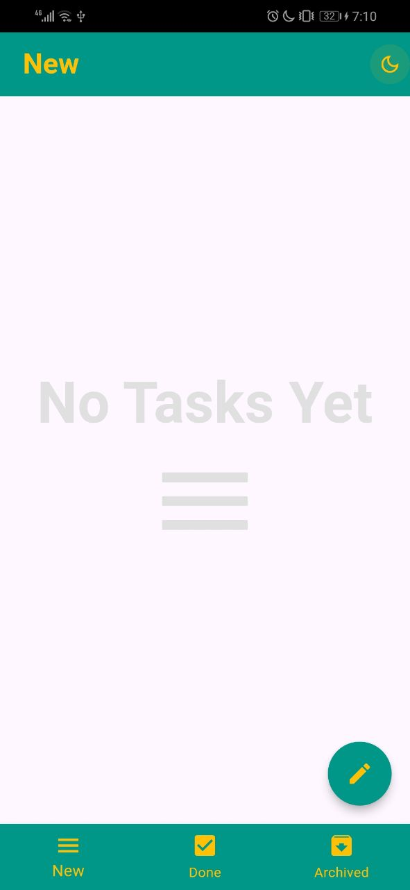
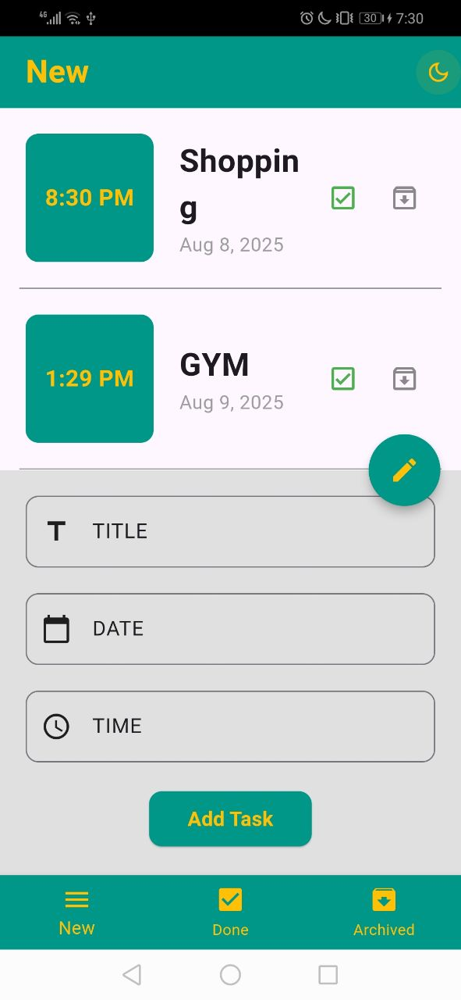
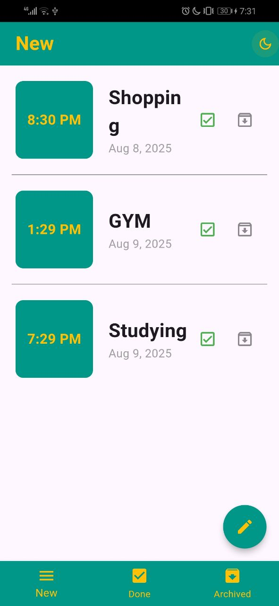
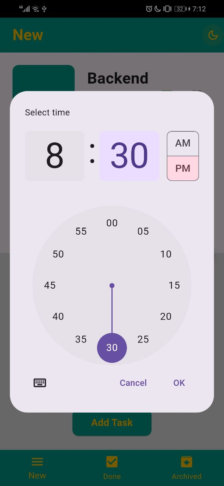
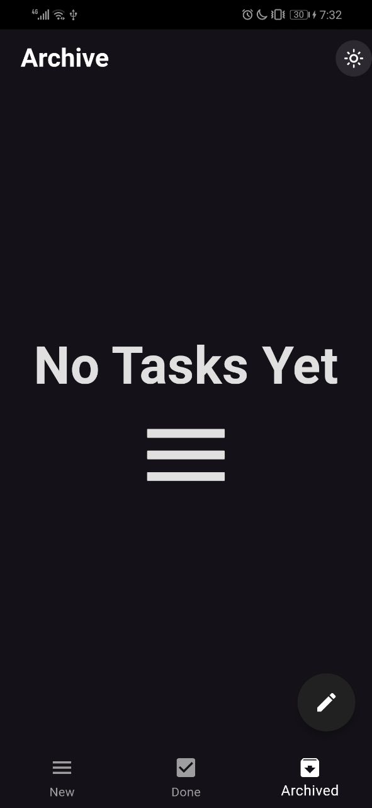
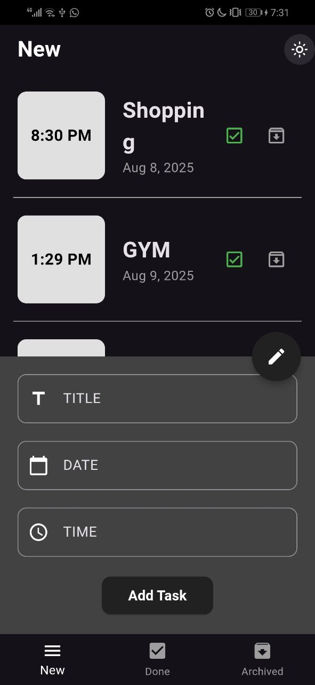
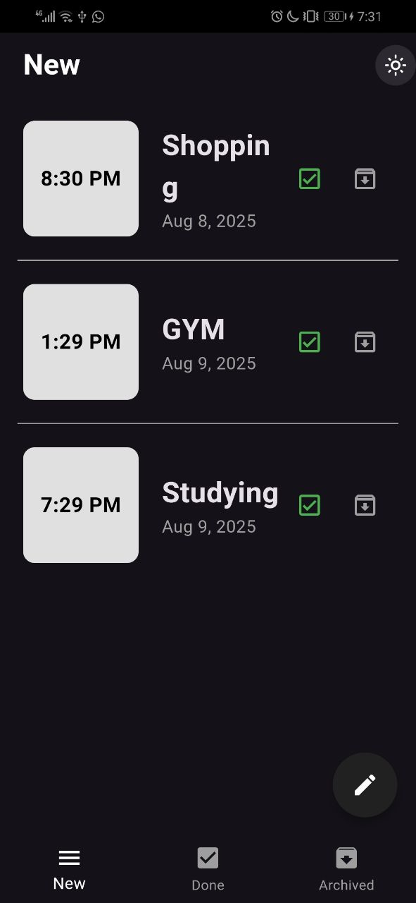
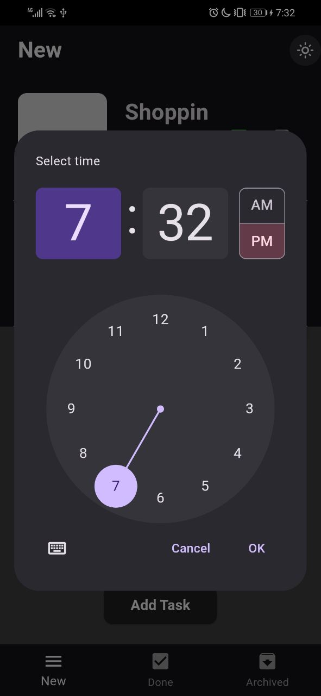
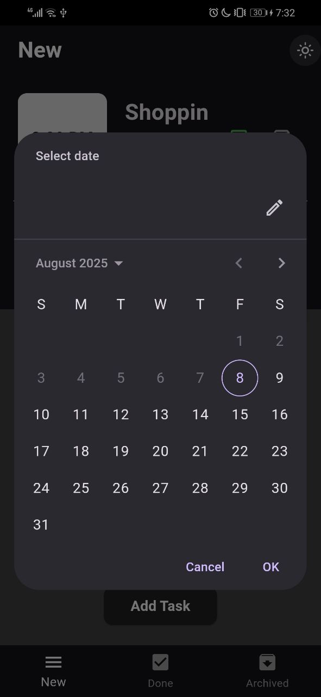

# To-Do App 📝

A Flutter task management application that helps users organize their daily tasks efficiently, featuring a clean interface and seamless user experience.

## Features

- **Task Management**: Create, complete, and archive tasks with ease
- **Dark/Light Theme**: Toggle between dark and light modes for personalized experience
- **Task Categories**: Organize tasks into New, Done, and Archive sections
- **Swipe to Delete**: Intuitive gesture-based task deletion
- **Date & Time Selection**: Built-in date and time pickers for task scheduling
- **Dynamic UI**: Responsive design that adapts to different screen sizes
- **Local Storage**: SQLite database for persistent task storage

## Technologies Used

- **Framework**: Flutter
- **State Management**: BLoC Pattern
- **Database**: SQLite
- **Theme Management**: Custom theme implementation
- **UI Components**: Material Design

## Task Management
The app uses SQLite database to store and manage tasks locally, providing fast and reliable task persistence.

## Screenshots
### Light Mode
|  |  |  |  |
|---------------------|-----------------------------|----------------------|---------------------|

### Dark Mode
|  |  |  |  |  |
|--------------------|-----------------------------|---------------------|--------------------|--------------------|
